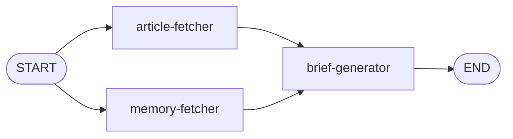

# Stage 4: Brief Generator

You've built an ingestion pipeline, a search engine, and a chatbot with memory. In this final stage, you'll bring it all together into a workflow that generates personalized news briefs. It fetches recent articles, retrieves long-term memories from AMS, and uses both to generate a brief tailored to your interests.

By the end of this stage, the **Brief** panel in the app will generate daily, weekly, or monthly news summaries—personalized based on what the chatbot has learned about you.

## What You'll Build

The brief workflow has a shape you haven't seen yet—two nodes running in parallel, both feeding into a third:

- **article-fetcher** — Fetches recent articles from the database based on the requested time period
- **memory-fetcher** — Retrieves long-term memories from AMS to personalize the brief
- **brief-generator** — Uses the articles and memories to generate a personalized news summary

## What You'll Learn

- How to use **parallel edges** to fan out from START to multiple nodes
- How fan-in works when parallel paths have **equal length**—no `defer` needed
- How to reuse **long-term memories** from the chatbot in a completely different workflow

## Files You'll Work In

All of the code for this stage lives in the `server/src/workflows/brief/` directory:

| File                              | What It Does                                                  |
| --------------------------------- | ------------------------------------------------------------- |
| `workflow.ts`                     | Builds the graph with parallel edges, compiles it, invokes it |
| `agents/article-fetcher-agent.ts` | Fetches articles for the requested time period                |
| `agents/memory-fetcher-agent.ts`  | Retrieves long-term memories from AMS                         |
| `agents/brief-generator-agent.ts` | Generates the personalized brief with an LLM                  |

The state, types, routes, and frontend are already wired up.

## Let's Go

Ready? This one's quick: [Building the Brief](1-building-the-brief.md).
