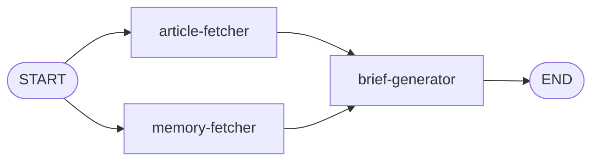

# Building the Brief

This is the final stretch. You'll build a workflow that fetches articles and memories in parallel, then generates a personalized news brief. Most of the patterns here are ones you've already used—this stage is about combining them.



## The Article Fetcher

Open `agents/article-fetcher-agent.ts`. This node calculates a date range based on the requested period (daily, weekly, or monthly), then calls `searchArticles` from Stage 2 to fetch recent articles. Copy this in:

```typescript
export async function articleFetcher(state: BriefState): Promise<Partial<BriefState>> {
  const { period } = state

  // Calculate start date based on period
  const now = Date.now()
  let offset: number

  switch (period) {
    case 'daily':
      offset = ONE_DAY_MS
      break
    case 'weekly':
      offset = ONE_WEEK_MS
      break
    case 'monthly':
      offset = ONE_MONTH_MS
      break
    default:
      offset = ONE_DAY_MS
  }

  const startDate = Math.floor((now - offset) / 1000)

  // Search for articles starting from the calculated date
  const result = await searchArticles({ startDate }, 250)

  return { articles: result.success ? result.articles : [] }
}
```

Nothing new here—it's the same `searchArticles` function you built in Stage 2 and wrapped as a tool in Stage 3. This time you're calling it directly—no tool wrapper needed since there's no LLM deciding whether to search. It just uses a date filter and a higher limit since briefs need more articles to work with.

## The Memory Fetcher

Open `agents/memory-fetcher-agent.ts`. This node retrieves long-term memories from AMS—the same memories the chatbot built up in Stage 3. The brief generator will use them to prioritize news that matches your interests.

Take a look at `services/memory-service/long-term-memory.ts` before you fill this in. The `searchLongTermMemories` function does a semantic search against AMS's long-term memory store. Notice the search query: `'user preferences interests likes dislikes topics'`—it's a broad query designed to cast a wide net over whatever AMS has learned about you. Since we want _all_ your preferences (not just ones related to a specific question), a general query like this works better than something specific.

Now fill in the node:

```typescript
export async function memoryFetcher(_state: BriefState): Promise<Partial<BriefState>> {
  try {
    const memories = await searchLongTermMemories()
    return { memories }
  } catch {
    // If no memories found, continue with empty memories
    return { memories: [] }
  }
}
```

The `try/catch` is a graceful fallback—if AMS has no memories yet (maybe you haven't chatted enough), the brief still generates, just without personalization. Note the `_state` parameter—the node doesn't need anything from state, but LangGraph.js requires the signature.

## The Brief Generator

Open `agents/brief-generator-agent.ts`. This node takes the articles and memories gathered by the two fetchers and generates a personalized brief. Fill in the function:

```typescript
export async function briefGenerator(state: BriefState): Promise<Partial<BriefState>> {
  const { period, articles, memories } = state

  /* If no articles found, return a brief message */
  if (articles.length === 0) return { brief: `No news articles found for the ${period} period.` }

  /* Build the prompt */
  const prompt = buildPrompt(period, articles, memories)

  /* Generate the brief */
  const llm = fetchLargeLLM()
  const response = await llm.invoke(prompt)
  const brief = response.content as string

  /* Return the brief */
  return { brief }
}
```

Notice the guard clause at the top—if no articles were found for the time period, it short-circuits with a simple message to save tokens and avoid an unnecessary LLM call.

The `buildPrompt` function is at the bottom of the file—take a look if you're curious. It assembles the articles and any memories into a prompt that asks the LLM to generate a concise news summary, prioritizing topics that match your interests.

## The Workflow

Open `workflow.ts`. This time you'll build the graph yourself. The new thing here is **parallel edges**—two edges from START:

```typescript
/* Add nodes */
graph.addNode('article-fetcher', articleFetcher)
graph.addNode('memory-fetcher', memoryFetcher)
graph.addNode('brief-generator', briefGenerator)

/* Add edges - article and memory fetchers run in parallel */
graph.addEdge(START, 'article-fetcher')
graph.addEdge(START, 'memory-fetcher')
graph.addEdge('article-fetcher', 'brief-generator')
graph.addEdge('memory-fetcher', 'brief-generator')
graph.addEdge('brief-generator', END)
```

The compile and invoke are already at the bottom of the file.

When two edges leave the same node, LangGraph runs both targets in parallel. Both `article-fetcher` and `memory-fetcher` run at the same time, and `brief-generator` waits for both to finish before it runs.

In Stage 1 you used `defer` to handle fan-in when parallel paths had different lengths. Here both paths are one node long, so the fan-in just works—`brief-generator` has two incoming edges and LangGraph knows to wait for both. No `defer` needed.

## Try It Out

Restart the server and open the **Brief** panel. Select a time period and generate a brief. You should see a news summary based on the articles in your database.

Now try this: go back to the **Chat** panel and tell the chatbot about your interests—"I'm really interested in technology and AI" or "I care a lot about climate policy." Chat for a bit so AMS has time to extract long-term memories. Then go back to the **Brief** panel and generate another brief. The summary should prioritize topics that match what you told the chatbot.

That's the full circle. The chatbot learns your preferences and stores them as long-term memories in AMS. The brief generator reads those same memories and uses them to personalize your news. Two different workflows, sharing the same memory through Redis.

## What You Built

Over four stages, you've built a complete AI news agent:

1. **Ingestion** — RSS feeds processed into enriched, searchable articles stored in Redis
2. **Search** — Vector similarity and structured filtering to find relevant articles
3. **Chatbot** — A ReAct agent with tools, short-term memory, and long-term memory via AMS
4. **Brief Generator** — Personalized news summaries using parallel execution and shared memory

All of it powered by Redis for data and memory, LangGraph.js for workflow orchestration, and OpenAI for the intelligence.

You're done. Nice work!
