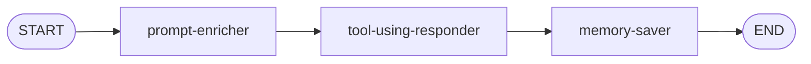

# Stage 3: Chatbot

In Stage 1 you built a pipeline that ingests articles. In Stage 2 you made them searchable. Now you'll build a conversational agent—a chatbot—that uses the search code you wrote in Stage 2 to find and discuss articles with the user. You'll give it short-term and long-term memory using **Agent Memory Server (AMS)**, so it can remember what was said earlier in the conversation and learn your preferences over time.

By the end of this stage, the **Chat** panel in the app will let you have conversations about the news. The chatbot will search for relevant articles, answer questions, and remember your interests across conversations.

## What You'll Build

The chatbot is a LangGraph.js workflow with three nodes in a straight line:



- **prompt-enricher** — Fetches conversation history and long-term memories from AMS, then builds the prompt messages that the LLM will see
- **tool-using-responder** — A ReAct agent that processes the prompt, calls the article search tool as needed, and generates a response
- **memory-saver** — Saves the new exchange (user message + assistant response) back to AMS so future turns have context

You'll build these out of execution order—starting with the middle node because it builds naturally on the search code from Stage 2, then add memory afterward.

## What You'll Learn

- How to wrap existing code as a **tool** that an LLM can call
- How **ReAct agents** work—the loop of reasoning, acting (calling tools), and observing results
- How to use `createReactAgent` from LangGraph.js to build a tool-using agent
- What **Agent Memory Server (AMS)** is and how it provides short-term and long-term memory
- How to save and retrieve **working memory** (conversation context) through AMS
- How **prompt enrichment** hydrates a prompt with memories before the LLM sees it

## Files You'll Work In

All of the code for this stage lives in the `server/src/workflows/chatbot/` directory:

| File                                   | What It Does                                        |
| -------------------------------------- | --------------------------------------------------- |
| `workflow.ts`                          | Builds the graph—adds nodes, edges, and compiles it |
| `tools/search-articles-tool.ts`        | Wraps article search as a tool the LLM can call     |
| `agents/tool-using-responder-agent.ts` | ReAct agent that responds using tools               |
| `agents/memory-saver-agent.ts`         | Saves the conversation exchange to AMS              |
| `agents/prompt-enricher-agent.ts`      | Enriches the prompt with memories from AMS          |

The state, types, routes, workflow, memory service client, and frontend are already wired up. You just need to build the tool and the three agents.

## A Quick Look at State

Open `state.ts`. You'll recognize the pattern from Stage 1—`Annotation.Root()` with typed fields:

```typescript
export const ChatAnnotation = Annotation.Root({
  sessionId: Annotation<string>(),
  userMessage: Annotation<string>(),
  promptMessages: Annotation<BaseMessage[]>(),
  responseMessage: Annotation<string>()
})
```

- **`sessionId`** — Identifies the conversation. AMS uses this to store and retrieve memory for this session.
- **`userMessage`** — The raw message from the user.
- **`promptMessages`** — The full set of LangChain.js messages (system, user, assistant) that the LLM will see. Built by the prompt enricher from AMS data.
- **`responseMessage`** — The assistant's response text. Set by the tool-using responder, read by the memory saver.

No changes needed here—just wanted you to see what's flowing through the graph.

## Let's Go

Ready? Start with [Tools & the ReAct Agent](1-tools-and-react-agent.md).
