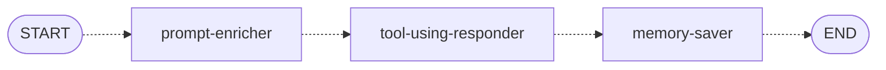
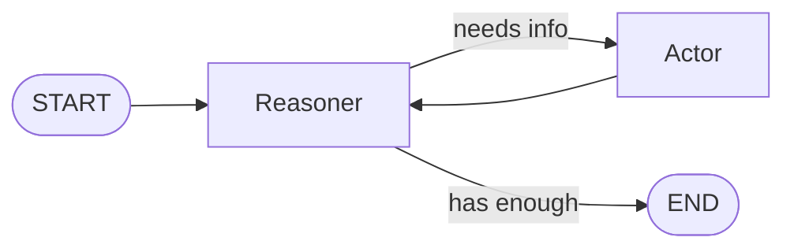

# Tools & the ReAct Agent

In Stage 2, you wrote code to search articles by topic, entity, date, and meaning. Now you'll make that search available to an LLM as a **tool**—so the chatbot can decide when and how to search based on what the user asks. You'll wire the tool into a **ReAct agent** that reasons about what to do, calls the tool, observes the results, and responds.

By the end of this step, you'll be able to chat with the bot and it will search for articles to answer your questions. It won't remember anything between turns yet—that comes next.



## Files You'll Work In

| File                                   | What It Does                                        |
| -------------------------------------- | --------------------------------------------------- |
| `tools/search-articles-tool.ts`        | Wraps article search as a tool the LLM can call     |
| `agents/tool-using-responder-agent.ts` | ReAct agent that responds using tools               |
| `workflow.ts`                          | Builds the graph—adds nodes, edges, and compiles it |

## The ReAct Pattern

Before diving into code, let's talk about how this chatbot works. **ReAct** stands for **Reasoning + Acting**. It's a general pattern for AI agents—not specific to any framework or even to tool use. The core idea is a loop:

1. **Reason** — The LLM considers the current situation. What's being asked? What does it already know? What action, if any, should it take?
2. **Act** — It takes an action. That could be calling a tool, delegating to another LLM, querying a database—anything that produces new information.
3. **Observe** — It reads the result of the action.
4. **Repeat** — If the result isn't sufficient, it reasons again and takes another action.
5. **Respond** — Once it has enough information, it generates a final answer.

If you were to build this as a LangGraph.js graph, it would look like this:



The Reasoner decides whether it needs more information or has enough to respond. If it needs more, it routes to the Actor—which could call a tool, delegate to another LLM, query a database, whatever—and the result flows back to the Reasoner to decide again. This loop continues until the Reasoner is satisfied and sends its response to END.

What makes this different from Chain of Thought (where the LLM just _thinks_ step by step) is that ReAct agents actually _do things_ between reasoning steps. A supervisor that delegates tasks to other LLMs is using ReAct. A coding assistant that runs tests and reads the output is using ReAct. In our case, the action is searching for articles using the code you wrote in Stage 2.

## What's a Tool?

In the ReAct diagram above, the Actor is deliberately vague—it could be anything that produces new information. One of the most common ways to implement that Actor is with **tools**. A tool in LangChain.js is a function that an LLM can choose to call. You define three things: a **schema** that describes the parameters, a **function** that does the work, and a **name and description** that tell the LLM what the tool is for. The Reasoner reads the schema and description, decides whether to call the tool, and fills in the parameters based on what the user asked.

## Building the Search Tool

Open `tools/search-articles-tool.ts`. At the bottom of the file you'll see a call to `tool()` from LangChain.js—this is what creates the tool object that the LLM can discover and call. It already has a name, description, and stubbed-out schema and function wired in. You'll replace those stubs with real implementations.

### The Schema

The schema tells the LLM what parameters are available. You've used Zod before—in Stage 1 you defined schemas for structured output so the LLM would return validated JSON. Here it serves a similar purpose: LangChain.js passes the schema to the LLM so it knows what parameters are available and how to fill them in. Each field has a type, an optional flag, and a `.describe()` string that explains what the parameter does to the LLM.

There's an empty `z.object({})` in the file. Fill it in with the fields the LLM needs:

```typescript
const searchArticlesSchema = z.object({
  semanticQuery: z.string().optional().describe('Natural language search query for semantic similarity search'),
  topics: z.array(z.string()).optional().describe('Filter by topics (AND logic - all must match)'),
  people: z.array(z.string()).optional().describe('Filter by people mentioned (AND logic)'),
  organizations: z.array(z.string()).optional().describe('Filter by organizations mentioned (AND logic)'),
  locations: z.array(z.string()).optional().describe('Filter by locations mentioned (AND logic)'),
  sources: z.array(z.string()).optional().describe('Filter by news sources (OR logic - any can match)'),
  startDate: z.number().optional().describe('Filter articles from this Unix timestamp (seconds)'),
  endDate: z.number().optional().describe('Filter articles until this Unix timestamp (seconds)'),
  limit: z.number().optional().default(5).describe('Maximum number of articles to return')
})
```

These `.describe()` strings are important—they're how the LLM understands what each parameter does. When the user asks "find me articles about AI from last week," the LLM reads these descriptions and decides to set `topics: ["AI"]` and fill in `startDate`/`endDate` with appropriate timestamps.

Below the schema you'll see a type derived from it:

```typescript
type SearchArticlesParams = z.infer<typeof searchArticlesSchema>
```

`z.infer` derives a TypeScript type directly from the Zod schema—so the type stays in sync with the schema automatically. It's already in the file; you'll see it used in the next section.

### The Tool Function

There's a stubbed-out `searchArticles` function that just returns an empty result. Fill in the body. It receives the parameters the LLM chose, calls the search service you wrote in Stage 2, and returns the results as JSON. We destructure `limit` out and spread the rest into `criteria`—which happens to be exactly the shape the search service expects:

```typescript
async function searchArticles(params: SearchArticlesParams): Promise<string> {
  const { limit, ...criteria } = params

  const result = await searchArticlesService(criteria, limit ?? 5)

  if (result.success) {
    // Transform articles to reduce context size and prevent LLM from using actual URLs
    const articles = result.articles.map(({ content, link, ...rest }) => rest)
    return JSON.stringify({ articles })
  }

  return JSON.stringify({ error: result.error, articles: [] })
}
```

A few things to notice:

- We strip `content` and `link` from the results—the LLM doesn't need the full article text or external URLs to answer questions, and removing them keeps the context window lean
- Results are serialized to JSON because tool outputs must be strings
- If the search fails, we return an error message. The LLM can use this to tell the user something went wrong

### Review the Tool Assembly

Scroll down to the `tool()` call at the bottom of the file. It takes two arguments: your `searchArticles` function and a configuration object with three fields:

- **`name`** — A unique identifier the LLM uses to specify which tool it wants to call
- **`description`** — A prompt that tells the LLM what the tool does, what fields are returned, and how to format results. Take a moment to read it
- **`schema`** — The Zod schema you just filled in, which tells the LLM what parameters are available

> You'll notice the description tells the LLM to construct relative URLs like `/article/{id}` rather than using the articles' actual links. This is a non-standard format—it exists so the workshop's UI can intercept those links and open the article detail view directly in the app. You'll see this again in the prompt in `agents/tool-using-responder-agent.ts`.

## Wiring It Up with `createReactAgent`

You've seen the ReAct pattern in theory—now let's implement it. LangGraph.js provides `createReactAgent`, a prebuilt graph that handles the tool-calling version of the ReAct loop for you. You give it an LLM, a list of tools, and a system message. It handles the routing between the LLM and tools until the LLM decides it's done. It's worth noting that `createReactAgent` is specifically for tool use—the broader ReAct pattern can involve other kinds of actions, but this prebuilt graph focuses on the tool-calling loop.

## Building the Tool-Using Responder

Open `agents/tool-using-responder-agent.ts`. The imports and `buildPrompt()` function are already there. You need to set up the ReAct agent and fill in the node function.

### Creating the Agent

At the module level (between the imports and the exported function), set up the tools, LLM, and ReAct agent:

```typescript
const llm = fetchLargeLLM()
const tools = [searchArticlesTool]

const reactAgent = createReactAgent({
  llm,
  tools,
  messageModifier: new SystemMessage(buildPrompt())
})
```

- **`fetchLargeLLM()`** returns a more capable model than `fetchLLM()`—the chatbot benefits from stronger reasoning
- **`messageModifier`** prepends a system message to every invocation, giving the agent its personality and instructions
- **`buildPrompt()`** is at the bottom of the file—take a moment to read it. It tells the agent what it is, what it can do, and how to format article links

### The Node Function

Now fill in the exported `toolUsingResponder` function. It invokes the ReAct agent with the prompt messages from state and extracts the final response:

```typescript
export async function toolUsingResponder(state: ChatState): Promise<Partial<ChatState>> {
  const result = await reactAgent.invoke({ messages: state.promptMessages })
  const responseMessage = result.messages[result.messages.length - 1].content as string
  return { responseMessage }
}
```

Where does `promptMessages` come from? Look at `prompt-enricher-agent.ts`—right now it's a simple stub that takes the user's message and wraps it as a `HumanMessage`. That's all the ReAct agent needs for now: a list of messages to respond to. In the final step, you'll replace that stub with code that enriches the prompt with conversation history and long-term memories from AMS.

The `messages` array in the result contains the full conversation—the system message, the messages from `state.promptMessages`, any tool calls and their results, and the final assistant response. We grab the last message, which is always the assistant's final answer, and return it as `responseMessage`.

## The Workflow

Open `workflow.ts`. The graph is already built for you—same pattern as Stage 1, just with different nodes. Take a look:

```typescript
graph.addNode('prompt-enricher', promptEnricher)
graph.addNode('tool-using-responder', toolUsingResponder)
graph.addNode('memory-saver', memorySaver)
```

All three nodes are wired in a straight line from START to END, even though you've only implemented the middle one. The `promptEnricher` currently just passes the user's message through, and `memorySaver` returns an empty object. The graph runs, the tool-using responder does the real work, and the other two are placeholders you'll fill in later.

At the bottom, `invokeChat` wraps the graph invocation—it takes a `sessionId` and `userMessage`, runs the workflow, and returns the response. This is what the route handler calls.

## Try It Out

Restart the server and open the **Chat** panel. Try asking something like:

- "What's the latest news about AI?"
- "Find me articles about climate change"
- "What are the top technology stories?"

The chatbot should search for articles and respond with relevant information, including clickable links to articles.

Now try this: ask a follow-up question that references your previous message—something like "Tell me more about the first one" or "What else do you know about that topic?" The chatbot won't know what you're talking about. Every message is a fresh start—it has no memory of what was said before.

That's what we'll fix next.

Next: [Saving Memory](2-saving-memory.md)
