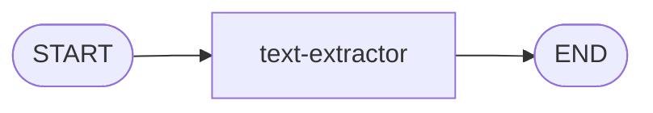

# The Simplest Graph: Text Extraction

In this section, you'll build the simplest possible LangGraph.js graph—a single node that extracts text from a raw feed item. Along the way, you'll learn the three core concepts that every LangGraph.js workflow is built from: **graph state**, **nodes**, and **edges**.

## How LangGraph.js Works

A LangGraph.js workflow is a directed graph. Data flows through it like this:

1. You define a **state** object that holds all the data flowing into, through, and out of the graph.
2. You write **nodes**—functions that read from state, do work, and return updates to state. They might even call an LLM.
3. You connect nodes with **edges** to define where the graph starts, where it ends, and the order the nodes run in.
4. You **compile** the graph and **invoke** it with an initial state

The graph runs each node in order, merging each node's returned updates back into the shared state. When all nodes have run, the final state is your result.

Here's what the graph you'll build in this section looks like:



## Files You'll Work In

All of the code for this step lives in the `server/src/workflows/ingestion/` directory:

| File                             | What It Does                                        |
| -------------------------------- | --------------------------------------------------- |
| `state.ts`                       | Defines the graph state that flows between nodes    |
| `workflow.ts`                    | Builds the graph—adds nodes, edges, and compiles it |
| `agents/text-extractor-agent.ts` | Extracts clean text from the raw feed item          |

## Defining the Graph State

The graph state is a shared object that every node can read from and write to. You define it using `Annotation.Root()` from LangGraph.js.

Open `state.ts`. You should see a minimal state with just `feedItem` and `article` fields:

```typescript
import { Annotation } from '@langchain/langgraph'
import type { ArticleData, FeedItem } from '@services'

export const ArticleAnnotation = Annotation.Root({
  feedItem: Annotation<FeedItem>(),
  article: Annotation<ArticleData>()
})

export type ArticleState = typeof ArticleAnnotation.State
```

The `feedItem` is the input—the raw RSS feed item that the ingestion loop passes in. The `article` is the output—the final, assembled article that we'll eventually return. For now, `article` won't be used.

Our text extractor node will need somewhere to put the extracted text. Add a `content` field to the state:

```typescript
export const ArticleAnnotation = Annotation.Root({
  feedItem: Annotation<FeedItem>(),
  content: Annotation<string>(),
  article: Annotation<ArticleData>()
})
```

Each field in the annotation defines a slot in the state object. When a node returns `{ content: 'some text' }`, LangGraph.js merges that into the shared state, and any subsequent node can read `state.content`.

> **Aside:** LangGraph.js also provides a built-in `MessagesAnnotation` for chatbot use cases where your state is just a list of messages. For workflows like this one, defining your own state gives you full control.

## Writing a Node

A node is just an async function. It takes the current state as input and returns a partial state update—an object with only the fields it wants to change.

Open `agents/text-extractor-agent.ts`. You'll see that the function structure is already there—imports, the function signature, and some commented-out guard clauses and logging. But the main logic is missing. Right now, it just returns an empty object:

```typescript
export async function textExtractor(state: ArticleState): Promise<Partial<ArticleState>> {
  // TODO: Extract the feed item from the state

  // /* Make sure we have a feed item */
  // if (!feedItem) throw new Error('No feed item to process')

  // ...commented-out guard clauses and logging...

  // TODO: Extract text from HTML, send to LLM, return content

  return {}
}
```

A few things to notice about the function signature: `(state: ArticleState) => Promise<Partial<ArticleState>>`. That's the pattern for every node—take the full state in, return a partial state out. LangGraph.js merges whatever you return back into the shared state. If you return `{ content: 'some text' }`, then `state.content` is now `'some text'` for every node that runs after this one.

### Pulling Data from State

The first thing any node needs to do is pull the data it needs from state. Add a destructure from state right after the first TODO comment:

```typescript
/* Extract the feed item from the state */
const { feedItem } = state
```

This grabs the `feedItem` that was passed in when the graph was invoked.

### Uncommenting the Guard Clauses

Now uncomment the guard clause, logging, and HTML check that are already in the file. These handle the case where there's no feed item, and the shortcut when there's no HTML to process:

```typescript
/* Make sure we have a feed item */
if (!feedItem) throw new Error('No feed item to process')

log('Text Extractor', 'Extracting article text')

/* If we don't have HTML, use the RSS content. Nothing to do here. */
if (!feedItem.html) {
  log('Text Extractor', 'No HTML available, using RSS content')
  return { content: feedItem.content }
}
```

Once you've added the destructure and uncommented these lines, the function can pull `feedItem` from state, validate it, and handle the no-HTML case.

There's also an `extractTextFromHtml` helper function at the bottom of the file. It uses the `html-to-text` library to strip HTML down to plain text—removing images, scripts, and styles while preserving links. We could use an LLM to remove all the HTML instead, but a library is faster and cheaper. Regardless, you won't need to change this function.

### Extracting and Cleaning the Text

Now let's fill in the missing logic. After the HTML check, add a call to `extractTextFromHtml` to convert the raw HTML into plain text:

```typescript
/* Extract the text from the HTML */
const text = extractTextFromHtml(feedItem.html)
```

The plain text is cleaner than the HTML, but it still has navigation, ads, and other noise. We'll use an LLM to extract just the article content. But first, we need a prompt.

### Writing the Prompt

Find the `buildPrompt` function at the bottom of the file. It's currently returning an empty string. Replace it with a prompt that tells the LLM what to extract and how to format it:

```typescript
function buildPrompt(text: string): string {
  return dedent`
    Extract the main article content from the following text.
    Return only the article text, excluding the title, ads, navigation, comments, and other non-article content.
    Do not include any preamble or explanation, just the extracted text.

    Format the output as Markdown:
    - Use paragraphs separated by blank lines
    - Preserve any links as [text](url)
    - Use headers (##, ###) if appropriate
    - Use lists where the content has bullet points
    - Do NOT include the article title (it is stored separately)

    Text:
    ${text}`
}
```

The `dedent` tag strips the leading whitespace so the prompt isn't indented when it reaches the LLM while keeping our code clean.

### Calling the LLM

Before we can call an LLM, we need one to call. Near the top of the file, after the imports, add:

```typescript
const llm = fetchLLM()
```

`fetchLLM()` is imported from `adapters/model-adapter.ts`. Open that file and take a look—it creates a `ChatOpenAI` instance configured with the model name, temperature, and API key. It also caches the instance so every node shares the same one. You don't need to change anything in this file, but it's worth knowing what's behind the call. You'll see other functions in there too—`fetchLargeLLM()`, `fetchEmbedder()`, `fetchTokenCounter()`—that we'll use in later steps.

Back in `textExtractor`, after extracting the text, build the prompt, send it to the LLM, and pull the content out of the response:

```typescript
/* Build the prompt, send it to the LLM, and get its response */
const prompt = buildPrompt(text)
const response = await llm.invoke(prompt)
const content = response.content as string
```

Calling `llm.invoke(prompt)` sends the prompt to the configured LLM and returns a response object. The actual text is in `response.content`.

### Returning the Result

Finally, uncomment the logging at the bottom of the function so you can see the token savings from raw HTML to clean text to extracted content, and change the return statement to return the extracted content:

```typescript
/* Log the token counts to show the massive savings */
log('Text Extractor', 'Tokens in HTML:', tokenCounter.encode(feedItem.html).length)
log('Text Extractor', 'Tokens in text:', tokenCounter.encode(text).length)
log('Text Extractor', 'Tokens in content:', tokenCounter.encode(content).length)

log('Text Extractor', 'Text extraction complete')

return { content }
```

By returning `{ content }`, LangGraph.js merges this into the shared state. Any node that runs after the text extractor can read `state.content` to get the cleaned article text.

## Building the Graph

Now you have a state and a node. Time to wire them into a graph.

Open `workflow.ts`. Note the imports at the top of the file:

- **`StateGraph`** — the class that lets you build graphs
- **`START`** and **`END`** — special constants representing the entry and exit points of a graph
- **`textExtractor`** — the node function you just wrote
- **`ArticleAnnotation`** — the state definition you just created

First, create a new `StateGraph`, passing in your annotation so the graph knows the shape of its state:

```typescript
/* Create the workflow graph for processing a single feed item into an article */
const graph = new StateGraph(ArticleAnnotation) as any
```

Next, add your text extractor as a node. The first argument is a name (you'll use this when wiring edges), and the second is the function:

```typescript
/* Add a node */
graph.addNode('text-extractor', textExtractor)
```

Now wire the edges. Edges define the order nodes run in. `START` and `END` are special constants—`START` is where the graph begins, and `END` is where it finishes:

```typescript
/* Add edges */
graph.addEdge(START, 'text-extractor')
graph.addEdge('text-extractor', END)
```

This says: when the graph starts, run the text extractor. When the text extractor finishes, the graph is done.

Next, compile the graph. This validates that all the edges connect properly and returns a runnable workflow:

```typescript
/* Compile the workflow */
const articleWorkflow = graph.compile()
```

Finally, update the `invokeArticleWorkflow` function to invoke the compiled graph:

```typescript
export async function invokeArticleWorkflow(feedItem: FeedItem): Promise<ArticleData | null> {
  const result = await articleWorkflow.invoke({ feedItem })
  return result.article ?? null
}
```

The `invoke()` call passes in the initial state—just the `feedItem`. The graph runs the text extractor node, which writes `content` to state. When the graph finishes, `result` contains the final state. Since we don't have an assembler node yet, `result.article` will be `undefined`, so we return `null`.

## Try It Out

Before you click **Ingest**, put a small number (like **1** or **2**) in the field next to the button. This limits how many articles get processed. Without a limit, the app will process every article from every feed—which takes a while and burns through API calls.

Click the **Ingest** button. You'll see the ingestion process run in the terminal. It will fetch feeds, process each item through your one-node graph, and log the text extraction results. Since the workflow returns `null` (no assembler yet), no articles will be saved—but you can see the text extractor doing its work in the terminal output.

In the next section, you'll add a second node to summarize the extracted text.

Next: [Multi-Node Graphs: Summarization](2-multi-node-graph.md)
