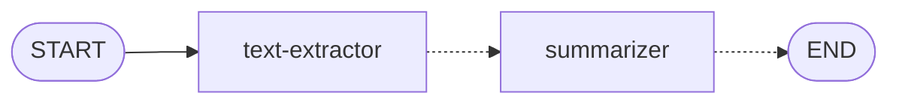
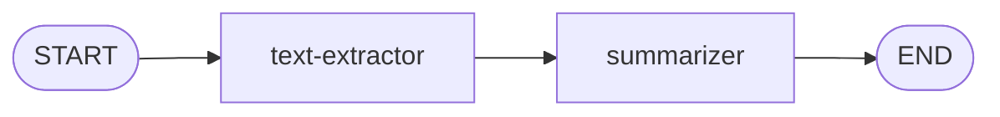

# Multi-Node Graphs: Summarization

Your graph has one node. Now you'll add a second—a summarizer that reads the extracted text and produces a concise summary. This introduces the key concept of **sequential chaining**: connecting one node's output to another node's input through shared state.



## Files You'll Work In

| File                         | What It Does                              |
| ---------------------------- | ----------------------------------------- |
| `state.ts`                   | Add a `summary` field to the graph state  |
| `agents/summarizer-agent.ts` | Generates a summary of the extracted text |
| `workflow.ts`                | Add the summarizer node and wire it in    |

## Adding to the State

The summarizer will need somewhere to put its output. Open `state.ts` and add a `summary` field to the annotation:

```typescript
export const ArticleAnnotation = Annotation.Root({
  feedItem: Annotation<FeedItem>(),
  content: Annotation<string>(),
  summary: Annotation<string>(),
  article: Annotation<ArticleData>()
})
```

Now any node can write to `state.summary` and any subsequent node can read from it.

## Writing the Summarizer Node

Open `agents/summarizer-agent.ts`. Like the text extractor, the function structure is already there—imports, the function signature, and some commented-out guard clauses and logging. You need to pull data from state, uncomment the guards, and fill in the LLM call.

### Pulling Data from State

Add a destructure at the top of the `summarizer` function to grab `content` from state:

```typescript
/* Extract content from state */
const { content } = state
```

Then uncomment the guard clause and logging that are already in the file:

```typescript
log('Summarizer', 'Generating summary')

/* If we don't have content, return an empty summary */
if (!content) {
  log('Summarizer', 'No content available to summarize. Returning empty summary.')
  return { summary: '' }
}
```

### Writing the Prompt

Find the `buildPrompt` function at the bottom of the file. Replace the empty string with a prompt that tells the LLM how to summarize:

```typescript
function buildPrompt(content: string): string {
  return dedent`
    Summarize the following article in 2-3 sentences.
    Focus on the key points and main takeaways.
    Do not include any preamble or explanation, just the summary.

    Article:
    ${content}`
}
```

### Calling the LLM

Back in the `summarizer` function, after the guard clause, add the LLM call. This follows the same pattern as the text extractor—build a prompt, invoke the LLM, pull out the response:

```typescript
/* Build the prompt, send it to the LLM, and get its response */
const prompt = buildPrompt(content)
const response = await llm.invoke(prompt)
const summary = response.content as string
```

### Returning the Result

Uncomment the logging at the bottom of the function and change the return statement to return the summary:

```typescript
/* Log the token counts to show the reduction */
log('Summarizer', 'Tokens in content:', tokenCounter.encode(content).length)
log('Summarizer', 'Tokens in summary:', tokenCounter.encode(summary).length)

log('Summarizer', 'Summary generation complete')

return { summary }
```

Notice this follows the same pattern as the text extractor: read from state, call an LLM, return a partial state update. This is a common pattern, but not the only one—you'll see nodes later that use structured output, embedding models, or no model at all.

## Wiring It Into the Graph

Open `workflow.ts`. You need to add the summarizer node and change the edges so the graph looks like this:



First, add the node after the text-extractor node:

```typescript
graph.addNode('summarizer', summarizer)
```

Now update the edges. Remove the edge from `text-extractor` to `END` and replace it with two new edges that chain through the summarizer:

```typescript
graph.addEdge('text-extractor', 'summarizer')
graph.addEdge('summarizer', END)
```

Your edge section should now look like this:

```typescript
graph.addEdge(START, 'text-extractor')
graph.addEdge('text-extractor', 'summarizer')
graph.addEdge('summarizer', END)
```

This is sequential chaining—each node runs in order, and each one can read the state that previous nodes have written. The text extractor writes `content`, and the summarizer reads it. Simple.

## Try It Out

Click **Ingest** again (keep that article limit small). In the terminal, you'll now see both the text extractor and the summarizer running for each feed item. The summarizer logs will show the token reduction—how a long article gets compressed down to a few sentences.

Still no articles saved (no assembler yet), but the workflow is getting richer.

Next: [Fan-Out: Parallel Processing](3-fan-out.md)
