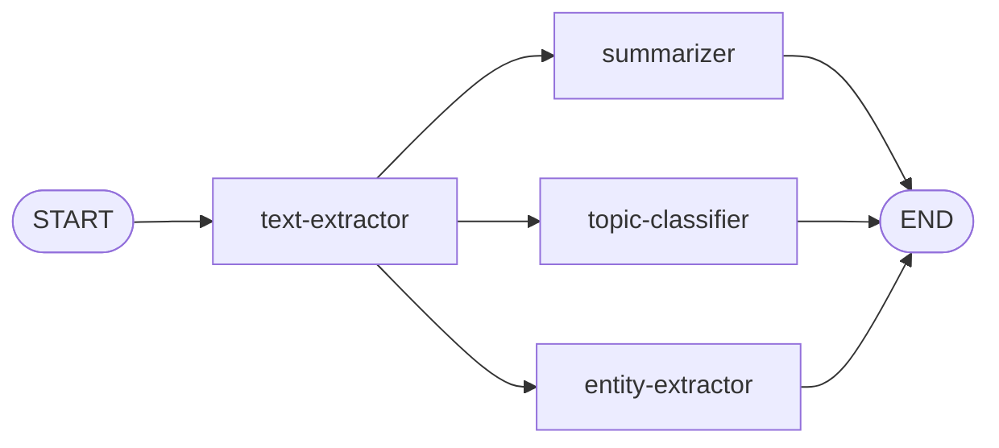
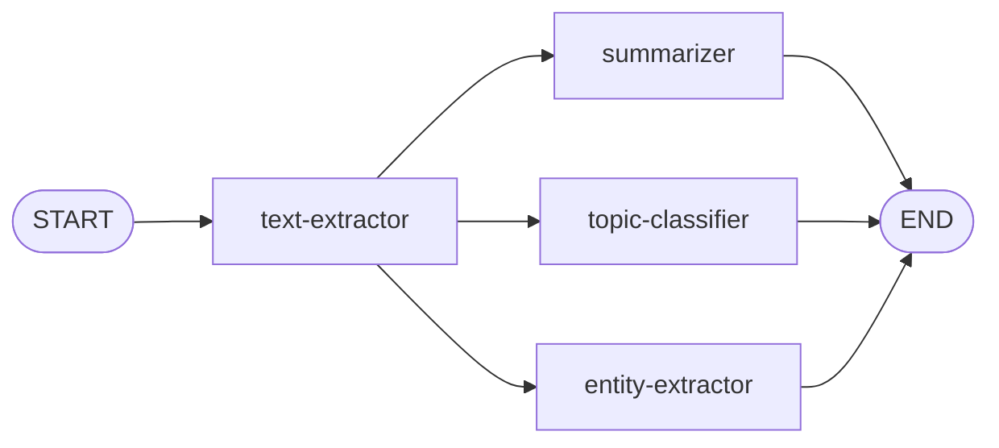

# Fan-Out: Parallel Processing

Your graph is a straight line: text extraction → summarization. Now you'll add two more processing nodes and run them **in parallel** with the summarizer. This introduces **fan-out**—multiple nodes triggered by the same upstream node, all running at the same time.



## Files You'll Work In

| File                               | What It Does                                  |
| ---------------------------------- | --------------------------------------------- |
| `state.ts`                         | Add fields for topics and entities            |
| `agents/topic-classifier-agent.ts` | Classifies the article into broad topics      |
| `agents/entity-extractor-agent.ts` | Extracts people, organizations, and locations |
| `workflow.ts`                      | Add the two new nodes and fan-out edges       |

## Adding to the State

Two new nodes means several new state fields. Open `state.ts` and add them:

```typescript
export const ArticleAnnotation = Annotation.Root({
  feedItem: Annotation<FeedItem>(),
  content: Annotation<string>(),
  summary: Annotation<string>(),
  topics: Annotation<string[]>({
    default: () => [],
    reducer: (prev, next) => [...prev, ...next]
  }),
  people: Annotation<string[]>({
    default: () => [],
    reducer: (prev, next) => [...prev, ...next]
  }),
  organizations: Annotation<string[]>({
    default: () => [],
    reducer: (prev, next) => [...prev, ...next]
  }),
  locations: Annotation<string[]>({
    default: () => [],
    reducer: (prev, next) => [...prev, ...next]
  }),
  article: Annotation<ArticleData>()
})
```

Most of the fields you've seen so far are simple—LangGraph.js just overwrites the old value with the new one. The array fields here use a **reducer** instead. A reducer tells LangGraph.js _how_ to merge a new value with the existing one. The `(prev, next) => [...prev, ...next]` reducer concatenates arrays, so if multiple writes happen, values accumulate rather than being replaced. The `default` gives them an initial value of `[]`.

Without a `default`, a field starts as `undefined`. Without a `reducer`, a new value simply replaces the old one—last write wins. You can use either option independently. A `reducer` without a `default` means the field starts `undefined`, so the reducer needs to handle that:

```typescript
count: Annotation<number>({
  reducer: (prev, next) => (prev ?? 0) + next
})
```

A `default` without a `reducer` means the field has an initial value but still overwrites on each write:

```typescript
status: Annotation<string>({
  default: () => 'pending'
})
```

For our array fields, the default and reducer together ensure they start empty and grow as nodes add to them.

## Writing the Topic Classifier

The topic classifier extracts broad topics like "Technology" or "Politics" from the article.

Open `agents/topic-classifier-agent.ts`. Like the previous nodes, you'll see TODOs and commented-out guard clauses and logging. This node also introduces a new concept: **structured output**. Instead of getting free-form text back from the LLM, you can get validated JSON that matches a schema you define. These schemas are defined using [Zod](https://zod.dev/), a TypeScript-first schema validation library.

### Defining the Schema

At the top of the file, you'll see Zod is already imported. Define a schema for the topics right after the imports:

```typescript
const topicsSchema = z.object({
  topics: z.array(z.string()).describe('Broad topics or categories for the article')
})
```

This schema defines an object with a single property, `topics`, which is an array of strings. The `.describe()` call adds a human-readable description for the schema. The `.describe()` calls aren't just documentation—LangChain passes them to the LLM as part of the function-calling schema, so they guide the model's output.

You might wonder why the schema defines an object with a single property instead of just the array. When using LangGraph.js with structured output, returning an object is the only thing permitted. No arrays. No primitives. So even if you just want a single property, it needs to be wrapped in an object.

Of course, schemas can be as simple or complex as needed. They can have nested objects, unions, and even custom logic. For this node, an array of strings is enough.

### Creating the LLM with Structured Output

Near the top of the file, you'll see the familiar `const llm = fetchLLM()`. Instead of using the LLM directly, chain `.withStructuredOutput()` onto it to tell the LLM to return data matching your schema:

```typescript
const llm = fetchLLM().withStructuredOutput(topicsSchema)
```

Now when you invoke this LLM, it won't return a free-text response. It'll return a parsed, validated object that matches `topicsSchema`—in this case, `{ topics: string[] }`.

### Writing the Prompt

Find the `buildPrompt` function and fill it in:

```typescript
function buildPrompt(title: string, content: string): string {
  return dedent`
    Extract 1-3 broad topics or categories for the following news article.
    Topics should be general categories like "Technology", "Politics", "Science", "Business", etc.
    You can also use more specific topics like "Artificial Intelligence", "Climate Change", "Space Exploration", etc.

    Title: ${title}

    Article: ${content}`
}
```

Notice the prompt doesn't mention JSON, schemas, or output format—it just describes _what_ to extract. The `.withStructuredOutput()` call handles the _how_, telling the LLM to return data matching the schema. The prompt focuses on intent; the schema focuses on shape; the description in the schema provides the intent of the shape.

### Pulling Data from State

In the `topicClassifier` function, start by pulling the data you need from state:

```typescript
/* Extract the feed item and content from the state */
const { feedItem, content } = state
```

Then uncomment the guard clauses and logging:

```typescript
log('Topic Classifier', 'Extracting topics')

/* Make sure we have the required data */
if (!feedItem) throw new Error('No feed item to process')
if (!content) throw new Error('No content to classify')
```

### Calling the LLM

After the guard clauses, add the LLM call. Note that `result` is already a parsed object that matches the schema. It has a `topics` property that contains an array of strings:

```typescript
/* Build the prompt and call the LLM with structured output */
const prompt = buildPrompt(feedItem.title, content)
const result = await llm.invoke(prompt)
```

Now uncomment the logging at the bottom of the function and add the return:

```typescript
log('Topic Classifier', 'Extracted topics:', result.topics.join(', '))

return { topics: result.topics }
```

## Writing the Entity Extractor

The entity extractor pulls named entities from the article and categorizes them into people, organizations, and locations.

Open `agents/entity-extractor-agent.ts`. Same pattern—TODOs and commented-out guards.

### Defining the Schema

This node also uses structured output, but with a richer schema. It has three properties: `people`, `organizations`, and `locations`, each an array of strings.

```typescript
const namedEntitiesSchema = z.object({
  people: z.array(z.string()).describe('Names of individuals mentioned in the article'),
  organizations: z.array(z.string()).describe('Companies, institutions, or government bodies mentioned'),
  locations: z.array(z.string()).describe('Countries, cities, or regions mentioned')
})
```

### Creating the LLM

Same as before—chain `.withStructuredOutput()` onto the existing `fetchLLM()` call:

```typescript
const llm = fetchLLM().withStructuredOutput(namedEntitiesSchema)
```

### Writing the Prompt

And another prompt:

```typescript
function buildPrompt(title: string, content: string): string {
  return dedent`
    Extract named entities from the following news article.
    Identify and categorize entities into three types:
    - People: Names of individuals (e.g., "Elon Musk", "Joe Biden", "Madonna")
    - Organizations: Companies, institutions, government bodies, etc. (e.g., "Microsoft", "NASA", "European Union")
    - Locations: Countries, cities, regions (e.g., "United States", "San Francisco", "Europe", "Appalachia")

    Title: ${title}

    Article: ${content}`
}
```

### Pulling Data from State

Same as the topic classifier—destructure the data and uncomment the guards:

```typescript
/* Extract the feed item and content from the state */
const { feedItem, content } = state
```

Then uncomment the guard clauses and logging:

```typescript
log('Entity Extractor', 'Extracting named entities')

/* Make sure we have the required data */
if (!feedItem) throw new Error('No feed item to process')
if (!content) throw new Error('No content to extract entities from')
```

### Calling the LLM

Now the LLM call. This time the result has three properties which match the three properties on the state. Up until now, every node has returned a single property—`{ content }`, `{ summary }`, `{ topics: result.topics }`. A node can return as many state properties as it wants in one object. LangGraph.js merges them all into the state, applying reducers where defined:

```typescript
/* Build the prompt and call the LLM with structured output */
const prompt = buildPrompt(feedItem.title, content)
const namedEntities = await llm.invoke(prompt)
```

Uncomment the logging at the bottom of the function and add the return:

```typescript
log('Entity Extractor', 'Extracted named entities:')
log('Entity Extractor', '  People:', namedEntities.people.join(', ') || 'none')
log('Entity Extractor', '  Organizations:', namedEntities.organizations.join(', ') || 'none')
log('Entity Extractor', '  Locations:', namedEntities.locations.join(', ') || 'none')

return {
  people: namedEntities.people,
  organizations: namedEntities.organizations,
  locations: namedEntities.locations
}
```

## Wiring the Fan-Out

Open `workflow.ts`. Add the two new nodes after the summarizer:

```typescript
graph.addNode('topic-classifier', topicClassifier)
graph.addNode('entity-extractor', entityExtractor)
```

Now for the edges. This is where fan-out happens. Instead of a straight line, you'll create multiple branches from `text-extractor`:



Replace your edge section with:

```typescript
graph.addEdge(START, 'text-extractor')

/* After text extraction, three paths run in parallel */
graph.addEdge('text-extractor', 'summarizer')
graph.addEdge('text-extractor', 'topic-classifier')
graph.addEdge('text-extractor', 'entity-extractor')

/* All parallel branches end the graph */
graph.addEdge('summarizer', END)
graph.addEdge('topic-classifier', END)
graph.addEdge('entity-extractor', END)
```

The fan-out is just calling `addEdge` multiple times from the same source node. LangGraph.js sees three edges leaving `text-extractor` and runs those three targets **in parallel**. No special syntax, no parallel API—just multiple edges.

The topic classifier and entity extractor only need `content`, which is available right after text extraction—so they run alongside the summarizer without waiting for it.

The graph finishes when all branches reach `END`.

## Try It Out

Click **Ingest** again (keep that article limit small—each article now makes multiple LLM calls). This time you'll see three nodes running in parallel for each feed item. The topic classifier, entity extractor, and summarizer all start at the same time after text extraction. Check the logs—you'll see topics and named entities alongside the text and summary.

Still no articles saved, but the workflow is branching now.

Next: [Embeddings](4-embeddings.md)
