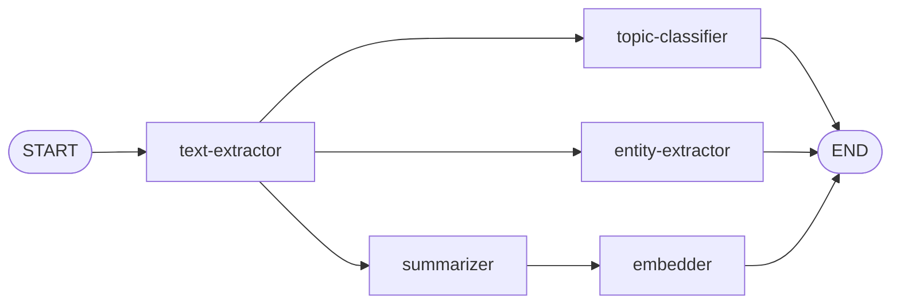

# Embeddings

Your graph fans out three branches from `text-extractor`. Now you'll extend the summarizer branch with an **embedder** that converts the article into a vector of numbers. This vector will power semantic search later, letting users find articles by meaning rather than keywords.

The embedder is different from the other nodes in two ways: it doesn't use an LLM, and it depends on the summary—so it chains after the summarizer rather than branching directly from `text-extractor`.


## Files You'll Work In

| File                       | What It Does                                          |
| -------------------------- | ----------------------------------------------------- |
| `state.ts`                 | Add an `embedding` field to the graph state           |
| `agents/embedder-agent.ts` | Creates a vector embedding from the title and summary |
| `workflow.ts`              | Add the embedder node and wire it after summarizer    |

## Adding to the State

Open `state.ts` and add an `embedding` field:

```typescript
export const ArticleAnnotation = Annotation.Root({
  feedItem: Annotation<FeedItem>(),
  content: Annotation<string>(),
  summary: Annotation<string>(),
  topics: Annotation<string[]>({
    default: () => [],
    reducer: (prev, next) => [...prev, ...next]
  }),
  people: Annotation<string[]>({
    default: () => [],
    reducer: (prev, next) => [...prev, ...next]
  }),
  organizations: Annotation<string[]>({
    default: () => [],
    reducer: (prev, next) => [...prev, ...next]
  }),
  locations: Annotation<string[]>({
    default: () => [],
    reducer: (prev, next) => [...prev, ...next]
  }),
  embedding: Annotation<number[]>(),
  article: Annotation<ArticleData>()
})
```

No reducer needed here—there's only one embedder, so a simple overwrite is fine but note that the embedding is an array of numbers. Each number represents a dimension in the vector space. Our embedding model generates 1536 dimensions so the embedding will always be an array of 1536 numbers.

## Writing the Embedder

Open `agents/embedder-agent.ts`. This node doesn't use an LLM at all. Instead, it uses an **embedding model**—a model specifically designed to convert text into a dense vector of floating-point numbers. These vectors capture semantic meaning: articles about similar topics will have vectors that are close together in vector space.

### Creating the Embedding Model

At the top of the file, create the embedding model instance:

```typescript
const embeddingModel = fetchEmbedder()
```

This is `fetchEmbedder()`, not `fetchLLM()`. You saw it in `adapters/model-adapter.ts` back in step 1 if you want to look again. Embedding models are a different kind of model—they don't generate text, they generate vectors.

### Pulling Data from State

In the `embedder` function, start by destructuring the data from state and uncommenting the guard clauses:

```typescript
/* Extract feedItem and summary from the state */
const { feedItem, summary } = state
```

Then uncomment the guard clauses and logging:

```typescript
log('Embedder', 'Generating embedding')

/* Make sure we have the required data */
if (!feedItem) throw new Error('No feed item to process')
if (!summary) throw new Error('No summary to embed')
```

### Generating the Embedding

After the guard clauses, combine the title and summary into a single string:

```typescript
/* Combine title and summary for embedding */
const textToEmbed = `${feedItem.title}\n\n${summary}`

log('Embedder', 'Embedding text:', textToEmbed.length, 'characters')
```

Then generate the embedding and return it:

```typescript
/* Generate the embedding */
const embedding = await embeddingModel.embedQuery(textToEmbed)

log('Embedder', 'Generated embedding:', embedding.length, 'dimensions')

return { embedding }
```

We embed the title and summary rather than the full content. The summary captures the key meaning in fewer tokens, and the title adds important context. This keeps the embedding focused and efficient.

## Wiring the Embedder

Open `workflow.ts`. Add the embedder node:

```typescript
graph.addNode('embedder', embedder)
```

Now update the edges. The embedder needs `summary` from state, so it must run **after** the summarizer. Remove the `summarizer → END` edge and replace it with a chain through the embedder:



```typescript
graph.addEdge(START, 'text-extractor')

/* After text extraction, three paths run in parallel */
graph.addEdge('text-extractor', 'summarizer')
graph.addEdge('text-extractor', 'topic-classifier')
graph.addEdge('text-extractor', 'entity-extractor')

/* Embedder waits for summarizer to complete */
graph.addEdge('summarizer', 'embedder')

/* All parallel branches end the graph */
graph.addEdge('topic-classifier', END)
graph.addEdge('entity-extractor', END)
graph.addEdge('embedder', END)
```

Notice the graph still has three parallel branches from `text-extractor`—but one of those branches is now two nodes deep (summarizer → embedder). LangGraph.js handles this naturally. The topic classifier and entity extractor don't wait for the summarizer or embedder; they run as soon as text extraction is done.

## Try It Out

Click **Ingest** again (same small limit). You'll now see embedding dimensions in the logs alongside topics and entities. The embedder runs after the summarizer finishes, while the other two branches complete independently.

Still no articles saved—all these pieces need to be gathered together. That's next.

Next: [Fan-In: The Article Assembler](5-fan-in.md)
