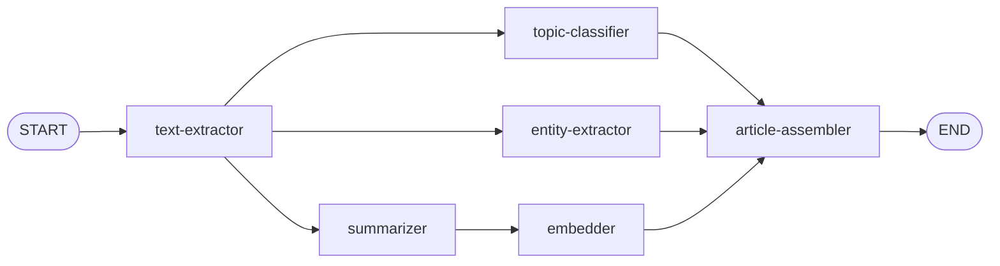

# Fan-In: The Article Assembler

Your graph fans out into three parallel branches, but right now each branch ends independently at `END`. The pieces—summary, topics, entities, embedding—are all in the state, but nothing brings them together. You need a node that waits for **all** branches to finish, then assembles the final article.

This is **fan-in**—the counterpart to fan-out.


## Files You'll Work In

| File                                | What It Does                                         |
| ----------------------------------- | ---------------------------------------------------- |
| `agents/article-assembler-agent.ts` | Assembles all the pieces into a final `ArticleData`  |
| `workflow.ts`                       | Add the assembler node with `defer` and rewire edges |

## No State Changes

The `article` field is already in the state from step 1—we just haven't used it yet. No changes to `state.ts` this time.

## Writing the Article Assembler

Open `agents/article-assembler-agent.ts`. This node is different from everything you've built so far—it doesn't call an LLM or any model at all. It just reads from state and reshapes the data into the `ArticleData` type that the rest of the application expects.

### Pulling Data from State

The assembler needs everything. Destructure all the fields from state:

```typescript
const { feedItem, content, summary, topics, people, organizations, locations, embedding } = state
```

Then uncomment the logging that's already in the file:

```typescript
log('Article Assembler', 'Assembling final article')
log('Article Assembler', 'State check - embedding:', embedding ? `${embedding.length} dimensions` : 'undefined')
```

### Guard Clauses

Every piece must be present. If anything is missing, the article can't be assembled. Uncomment the guard clauses that are already in the file:

```typescript
if (!feedItem) throw new Error('No feed item to assemble')
if (!content) throw new Error('No content to assemble')
if (!summary) throw new Error('No summary to assemble')
if (!topics || topics.length === 0) throw new Error('No topics to assemble')
if (!people) throw new Error('No people to assemble')
if (!organizations) throw new Error('No organizations to assemble')
if (!locations) throw new Error('No locations to assemble')
if (!embedding || embedding.length === 0) throw new Error('No embedding to assemble')
```

### Assembling the Article

Build the `ArticleData` object. This reshapes the flat state fields into the nested structure the application uses:

```typescript
const article: ArticleData = {
  title: feedItem.title,
  link: feedItem.link,
  publicationDate: Math.floor(new Date(feedItem.pubDate).getTime() / 1000),
  source: {
    title: feedItem.feedTitle,
    link: feedItem.feedLink
  },
  content: content,
  summary: summary,
  topics: topics,
  namedEntities: {
    people: people,
    organizations: organizations,
    locations: locations
  },
  embedding: embedding
}

log('Article Assembler', 'Article assembled successfully')

return { article }
```

Notice the `publicationDate` conversion—RSS feeds use ISO date strings, but the application stores dates as Unix timestamps in seconds. The `namedEntities` field nests the three entity arrays into a single object. You can look at the `ArticleData` type in `services/article-service/types.ts` to see the full shape.

## Wiring the Fan-In

Open `workflow.ts`. Add the assembler node, but with an important difference—the third argument:

```typescript
graph.addNode('article-assembler', articleAssembler, { defer: true })
```

The `{ defer: true }` option is what makes fan-in work. It tells LangGraph.js: "Don't run this node as soon as one incoming edge arrives. Wait until **all** incoming edges have completed." Without `defer`, the assembler would run as soon as the first branch finished, and the state would be missing data from the other branches.

Now rewire the edges. Remove the three `→ END` edges from the parallel branches and point them all at `article-assembler` instead:



```typescript
graph.addEdge(START, 'text-extractor')

/* After text extraction, three paths run in parallel */
graph.addEdge('text-extractor', 'summarizer')
graph.addEdge('text-extractor', 'topic-classifier')
graph.addEdge('text-extractor', 'entity-extractor')

/* Embedder waits for summarizer to complete */
graph.addEdge('summarizer', 'embedder')

/* All three enrichment branches must complete before assembly */
graph.addEdge('topic-classifier', 'article-assembler')
graph.addEdge('entity-extractor', 'article-assembler')
graph.addEdge('embedder', 'article-assembler')

graph.addEdge('article-assembler', END)
```

Three edges point into `article-assembler`. Because the node is deferred, LangGraph.js waits for all three to arrive before running it. The assembler then has the complete state—every field populated by the upstream nodes.

## Try It Out

Click **Ingest** again. This time you'll actually see articles in the UI—up until now, the response has been empty because the workflow never produced a finished article. With the assembler in place, the workflow returns a complete `ArticleData` object, and the ingestion loop sends it back to the UI.

The articles aren't persisted to Redis yet, though. If you refresh the page, they're gone. That's the final step.

Next: [Storing Articles in Redis](6-storing-in-redis.md)
