<!-- SECTION: Introduction & Setup -->
<!-- ============================= -->

<!-- _class: title hyper -->

# Build your own AI news agent

## with Redis + LangGraph.js

---

<!-- _class: speaker dark -->


# Guy Royse

## Senior Developer Advocate, Redis

## Socials

 @guyroyse

 github.com/guyroyse

 @guy.dev

 guy.dev

---

<!-- _class: hero dark no-logo -->


# AI is changing everything

---

<!-- _class: blank light -->


---

<!-- _class: blank light -->


Building apps with AI.

&nbsp;

---

<!-- _class: blank light -->


Building apps with AI.

Build apps that **_use_** AI.

---

<!--  _class: centered-images dark -->

# Tools we're using today


---

<!--  _class: content dark -->

# LangGraph.js

## &nbsp;


Workflow Orchestration

- Graph-based
- Nodes define the work
- Edges define the flow

Custom Annotations

- Define the state the workflow updates

---

<!--  _class: content dark -->

# Redis

## &nbsp;


###  &nbsp;&nbsp; Redis Search

###  &nbsp;&nbsp; Semantic Search

###  &nbsp;&nbsp; Agent Memory Server

---

<!-- _class: hero dark -->

# What are we building today?

---

<!-- _class: blank dark no-logo-->


---

<!-- _class: content dark -->

# Four components

## From raw feeds to personalized briefs

|     | Name      | What we're building                                                   |
| :-: | :-------- | :-------------------------------------------------------------------- |
|  1  | Ingestion | Process RSS feeds into enriched articles and store them in Redis      |
|  2  | Search    | Search articles by topic, entity, and meaning with Redis Search       |
|  3  | Chat      | Converse about the news and extract memories with Agent Memory Server |
|  4  | Brief     | Generate personalized news briefs                                     |

---

<!-- _class: hero hyper -->

# Let's get set up

---

<!-- _class: content dark -->

# Two options

## &nbsp;

### Option A: Remote virtual environment

- No install needed
- Scan the QR code and follow the instructions

&nbsp;

### Option B: Local Docker environment

- Runs locally in Docker
- Clone the repo and run `docker compose up`

---

<!-- _class: centered-content dark -->

# Remote virtual environment

## Scan the QR code


&nbsp;

### Follow the instructions to get your environment set up.

You will be asked for you email address.
You'll be emailed a link to your environment so don't lie.

---

<!-- _class: centered-content dark -->

# Local Docker environment

## Clone this if you're using Docker


&nbsp;

```bash
$ git clone git@github.com:redis-developer/
            ai-news-agent-lang-graph-js-redis-workshop.git
$ docker compose up -d
```

### Open `localhost` in your browser.

---

<!-- _class: centered-content dark -->

# The cheat code

## If you get stuck...


&nbsp;

`github.com/redis-developer/ai-news-agent-lang-graph-js-redis-demo`

---

<!-- _class: blank dark -->


---

<!-- SECTION: Stage 1 — Feed Ingestion -->
<!-- =================================== -->

<!-- _class: hero hyper -->

# Stage 1: Feed ingestion

---

<!-- _class: content dark -->

# What we're building

## An ingestion pipeline

- Fetch RSS feeds
- Extract clean text from HTML
- Summarize, classify topics, extract entities
- Generate vector embeddings
- Assemble and store in Redis

---

<!-- _class: centered-content dark -->

# The final graph

## What you'll build by the end of Stage 1


---

<!-- _class: hero dark -->

# LangGraph.js basics

---

<!-- _class: content dark -->

# How LangGraph.js works

## Four steps to every workflow

1. Define a **state** — the data flowing through the graph
2. Write **nodes** — functions that transform state
3. Connect with **edges** — define execution order
4. **Compile** and **invoke**

---

<!-- _class: hero dark -->

# The simplest graph

---

<!-- _class: centered-content dark -->

# A single node

## START → text-extractor → END

&nbsp;


---

<!-- _class: content dark -->

# Defining state

## `Annotation.Root()` defines the shape

```typescript
export const ArticleAnnotation = Annotation.Root({
  feedItem: Annotation<FeedItem>(),
  content: Annotation<string>(),
  article: Annotation<ArticleData>()
})
```

- Each field is a slot in the shared state
- Nodes read from and write to these slots

---

<!-- _class: content dark -->

# Writing a node

## Functions that transform state

```typescript
async function textExtractor(state: ArticleState): Promise<Partial<ArticleState>> {
  const { feedItem } = state

  const text = extractTextFromHtml(feedItem.html)
  const prompt = buildPrompt(text)
  const llm = fetchLLM()
  const response = await llm.invoke(prompt)

  return { content: response.content as string }
}
```

- Takes full state in, returns partial state out
- LangGraph.js merges the return into shared state

---

<!-- _class: content dark -->

# Fetching the LLM

## Using LangChain.js

```typescript
export function fetchLLM(): ChatOpenAI {
  return new ChatOpenAI({
    modelName: 'gpt-4o-mini',
    temperature: 0.3,
    apiKey: OPENAI_API_KEY
  })
}
```

---

<!-- _class: content dark -->

# Wiring the graph

## Nodes + edges + compile

```typescript
const graph = new StateGraph(ArticleAnnotation)

graph.addNode('text-extractor', textExtractor)

graph.addEdge(START, 'text-extractor')
graph.addEdge('text-extractor', END)

const workflow = graph.compile()
```

- Add nodes
- Connect with edges
- Compile

---

<!-- _class: content dark -->

# Invoking the workflow

## Compile once, invoke many times

```typescript
const initialState = { feedItem }
const finalState = await articleWorkflow.invoke(initialState)
console.log(finalState.article)
```

- Pass initial state to `invoke()`
- Get final state back when the graph completes

---

<!-- _class: hero dark -->

# Multi-node graphs

---

<!-- _class: centered-content dark -->

# Adding the summarizer

## START → text-extractor → summarizer → END

&nbsp;


---

<!-- _class: content dark -->

# The Summarizer Node

## Same pattern as the text extractor

```typescript
async function summarizer(state: ArticleState): Promise<Partial<ArticleState>> {
  const { content } = state

  const prompt = buildPrompt(content)
  const llm = fetchLLM()
  const response = await llm.invoke(prompt)

  return { summary: response.content as string }
}
```

- Reads `content` written by the text extractor
- Writes `summary` back to state

---

<!-- _class: content dark -->

# Sequential chaining

## One node's output is the next node's input

```typescript
graph.addNode('text-extractor', textExtractor)
graph.addNode('summarizer', summarizer)

graph.addEdge(START, 'text-extractor')
graph.addEdge('text-extractor', 'summarizer')
graph.addEdge('summarizer', END)
```

- Text extractor writes `content` to state
- Summarizer reads `content` from state

---

<!-- _class: hero dark -->

# Fan-out: Parallel processing

---

<!-- _class: centered-content dark -->

# Three branches from text-extractor

## Summarizer, topic classifier, entity extractor — all at once



---

<!-- _class: content dark -->

# Fan-out is just multiple edges

## Three edges from one node → runs all three **in parallel**

```typescript
...
graph.addNode('text-extractor', textExtractor)
graph.addNode('summarizer', summarizer)
graph.addNode('topic-classifier', topicClassifier)
graph.addNode('entity-extractor', entityExtractor)

graph.addEdge(START, 'text-extractor')
graph.addEdge('text-extractor', 'summarizer')
graph.addEdge('text-extractor', 'topic-classifier')
graph.addEdge('text-extractor', 'entity-extractor')
...
```

---

<!-- _class: content dark -->

# Unstructured output

## LLMs return strings — but you need data

"The topics are Technology, AI, and Business"

"The named entities are Mark Zuckerberg, Apple, and San Francisco"

&nbsp;

What do you do?

- Give the LLM really explicit instructions?
- Parse it? Regex? Hope for the best?
- What if the LLM changes its formatting?

---

<!-- _class: content dark -->

# Structured output

Define a schema with Zod:

```typescript
const topicsSchema = z.object({
  topics: z.array(z.string()).describe('Broad topics for the article')
})
```

Tell the LLM to use that schema:

```typescript
const llm = fetchLLM().withStructuredOutput(topicsSchema)
const result = await llm.invoke(prompt)
```

Get validated JSON back:

```json
{ "topics": ["Technology", "Artificial Intelligence"] }
```

No parsing, no regex, no guessing

---

<!-- _class: content dark -->

# The topic classifier node

## Structured output in action

```typescript
async function topicClassifier(state: ArticleState): Promise<Partial<ArticleState>> {
  const { feedItem, content } = state

  const prompt = buildPrompt(feedItem.title, content)
  const llm = fetchLLM().withStructuredOutput(topicsSchema)
  const result = await llm.invoke(prompt)

  return { topics: result.topics }
}
```

---

<!-- _class: content dark -->

# State for parallel branches

## Replacing state

```typescript
export const ArticleAnnotation = Annotation.Root({
  content: Annotation<string>({
    default: () => ''
    reducer: (prev, next) => next
  })
})
```

- **`default`** — provides an initial value
- **`reducer`** — replaces existing data

---

<!-- _class: content dark -->

# State for parallel branches

## Merging state

```typescript
export const ArticleAnnotation = Annotation.Root({
  topics: Annotation<string[]>({
    default: () => [],
    reducer: (prev, next) => [...prev, ...next]
  })
})
```

- **`default`** — starts as an empty array
- **`reducer`** — concatenates arrays

---

<!-- _class: hero dark -->

# Embeddings

---

<!-- _class: content dark -->

# What are embeddings?

## Numbers that capture meaning

- Unstructured data converted to a vector
- Essentially just coordinates in a high-dimensional space
- Nearby points have similar meanings
- Farther away points have dissimilar meanings

## 

---

<!-- _class: centered-content dark -->

# Embedding the summary

## START → text-extractor → summarizer → embedder → END



---

<!-- _class: content dark -->

# The embedder node

## Same pattern but uses an embedding model

```typescript
async function embedder(state: ArticleState): Promise<Partial<ArticleState>> {
  const { feedItem, summary } = state

  const textToEmbed = `${feedItem.title}\n\n${summary}`
  const embeddingModel = fetchEmbedder()
  const embedding = await embeddingModel.embedQuery(textToEmbed)

  return { embedding }
}
```

---

<!-- _class: content dark -->

# Fetching the embedding model

## Using LangChain.js

```typescript
export function fetchEmbedder(): OpenAIEmbeddings {
  return new OpenAIEmbeddings({
    modelName: 'text-embedding-3-small',
    apiKey: OPENAI_API_KEY
  })
}
```

---

<!-- _class: hero dark -->

# Fan-in: Assembling the results

---

<!-- _class: centered-content dark -->

# All roads lead to the assembler

## Wait for all branches, then combine



---

<!-- _class: content dark -->

# Deferred nodes

## Waits for all incoming edges

```typescript
graph.addNode('article-assembler', articleAssembler, { defer: true })

graph.addEdge('topic-classifier', 'article-assembler')
graph.addEdge('entity-extractor', 'article-assembler')
graph.addEdge('embedder', 'article-assembler')

graph.addEdge('article-assembler', END)
```

- Without `defer`, it runs as soon as the first branch arrives
- With `defer`, it waits for **all** incoming edges

---

<!-- _class: hero dark -->

# Storing articles in Redis

---

<!-- _class: content dark -->

# Redis JSON

## Native JSON document storage

- Store, retrieve, and update JSON documents in Redis
- Every document lives at a **key** — just like any Redis value
- Access nested fields with **JSONPath** expressions

---

<!-- _class: content dark -->

# Setting and getting documents

## `JSON.SET` and `JSON.GET`

```bash
JSON.SET article:42 $ '{"title": "AI News", "topics": ["tech"]}'

JSON.GET article:42
# → {"title": "AI News", "topics": ["tech"]}
```

- `$` means "the root" of the document
- `JSON.SET` creates or overwrites the document at that key

---

<!-- _class: content dark -->

# JSONPath

## Reach into nested fields

```bash
JSON.GET article:42 $.title
# → ["AI News"]

JSON.GET article:42 $.topics
# → [["tech"]]

JSON.GET article:42 $.topics[0]
# → ["tech"]
```

- `$` = root, `.field` = property, `[n]` = array index
- Always returns an **array** of matches

---

<!-- _class: content dark -->

# In TypeScript

## The Node Redis client wraps these commands

```typescript
const key = `${KEY_PREFIX}${id}`
await redis.json.set(key, '$', article)

const doc = await redis.json.get(key)
const topics = await redis.json.get(key, { path: '$.topics' })
```

- `redis.json.set(key, path, value)` — store a document
- `redis.json.get(key)` — retrieve the whole document
- `redis.json.get(key, { path })` — retrieve a nested field

---

<!-- _class: hero dark -->

# Go do it!

---

<!-- SECTION: Stage 2 — Article Search -->
<!-- ================================== -->

<!-- _class: hero hyper -->

# Stage 2: Article search

---

<!-- _class: content dark -->

# Redis as a search engine

## Built into Redis — no external service

- Indexes JSON documents **in place**
- No data sync, no replication lag
- Watches for new documents automatically
- TAG, NUMERIC, TEXT, VECTOR, GEO field types

---

<!-- _class: hero dark -->

# Creating a search index

---

<!-- _class: centered-content dark -->

# Defining the schema

```typescript
await redis.ft.create(
  INDEX_NAME,
  {
    '$.source.title': { type: TAG, AS: 'source' },
    '$.topics[*]': { type: TAG, AS: 'topics' },
    '$.publicationDate': { type: NUMERIC, AS: 'date' },
    '$.embedding': {
      type: VECTOR,
      AS: 'embedding',
      ALGORITHM: FLAT,
      TYPE: 'FLOAT32',
      DIM: 1536,
      DISTANCE_METRIC: 'COSINE'
    }
  },
  { ON: 'JSON', PREFIX: KEY_PREFIX }
)
```

---

<!-- _class: content dark -->

# Field types

## Each serves a different query style

| Type        | Use Case            | Example                   |
| ----------- | ------------------- | ------------------------- |
| **TAG**     | Exact match         | `@topics:{AI}`            |
| **NUMERIC** | Ranges              | `@date:[1700000000 +inf]` |
| **VECTOR**  | Semantic similarity | KNN search                |
| **TEXT**    | Full-text search    | Stemming, phonetics       |
| **GEO**     | Radius queries      | By coordinates            |

---

<!-- _class: hero dark -->

# Structured Search

---

<!-- _class: content dark -->

# TAG queries

## Filter by exact values

```typescript
// AND logic — must match ALL
queryParts.push(`@topics:{AI}`)
queryParts.push(`@people:{Mark Zuckerberg}`)

// OR logic — match ANY
queryParts.push(`@source:{TechCrunch|Ars Technica}`)
```

---

<!-- _class: content dark -->

# NUMERIC queries

## Filter by ranges

```typescript
// Date range
queryParts.push(`@date:[${startDate} ${endDate}]`)

// Open-ended
queryParts.push(`@date:[${startDate} +inf]`)
```

---

<!-- _class: content dark -->

# Executing the search

## &nbsp;

```typescript
const query = queryParts.join(' ') // AND logic
const options = {
  LIMIT: { from: 0, size: limit },
  SORTBY: { BY: 'date', DIRECTION: 'DESC' }
}

const result = await redis.ft.search(INDEX_NAME, query, options)
```

---

<!-- _class: hero dark -->

# Semantic search

---

<!-- _class: centered-content dark -->

# Vector search

## Find articles by meaning, not keywords


---

<!-- _class: centered-content dark -->

# K-Nearest Neighbors

```typescript
// Embed the user's query
const embeddingModel = fetchEmbedder()
const embedding = await embeddingModel.embedQuery(query)
const vectorBuffer = Buffer.from(new Float32Array(embedding).buffer)

// Combine structured + vector search
const structuredQuery = queryParts.join(' ')
const vectorQuery = `[KNN ${limit} @embedding $vec]`
const query = `(${textQuery})=>[${semanticQuery}]`

const options = {
  PARAMS: { vec: vectorBuffer },
  SORTBY: { BY: '__embedding_score', DIRECTION: 'ASC' },
  LIMIT: { from: 0, size: limit }
}

const result = await redis.ft.search(INDEX_NAME, query, options)
```

---

<!-- _class: hero dark -->

# Go do it!

---

<!-- SECTION: Stage 3 — Chatbot -->
<!-- =========================== -->

<!-- _class: hero hyper -->

# Stage 3: Chatbot

---

<!-- _class: centered-content dark -->

# The Chatbot workflow

## Each node has a specific job


&nbsp;

| Node                     | What it does                     |
| :----------------------- | :------------------------------- |
| **prompt-enricher**      | Fetch memories, build the prompt |
| **tool-using-responder** | ReAct agent with search tool     |
| **memory-saver**         | Save the exchange to AMS         |

---

<!-- _class: hero dark -->

# Tools & the ReAct agent

---

<!-- _class: content dark -->

# The ReAct pattern

## Reasoning + acting

1. **Reason** — What's being asked? What do I know?
2. **Act** — Call a specialized agent to get new information
3. **Observe** — Read the result
4. **Repeat** — Until satisfied



---

<!-- _class: content dark -->

# The ReAct pattern

## Calling tools

1. **Reason** — What's being asked? What do I know?
2. **Act** — Call an agent with a tool to do something
3. **Observe** — Read the result
4. **Repeat** — Until satisfied



---

<!-- _class: content dark -->

# What's a tool?

## A function the LLM can call

```typescript
function searchArticles(param): Promise<string> { ... }

const searchArticlesTool = tool(searchArticles, {
  name: 'search_articles',
  description: 'Search for news articles...',
  schema: z.object({
    semanticQuery: z.string().optional().describe('Natural language search query'),
    topics: z.array(z.string()).optional().describe('Filter by topics')
    // ...more fields
  })
})
```

- Build it with `tool()` from LangChain.js
- A **schema** defines the parameters

---

<!-- _class: content dark -->

# ReAct Agents in LangGraph.js

## Builds the loop for you (but only for tools)

```typescript
const llm = fetchLLM()
const tools = [searchArticlesTool]

const toolUsingResponder = createReactAgent({
  llm,
  tools,
  messageModifier: new SystemMessage(buildPrompt())
})
```

- Give it an LLM, tools, and a system message
- It handles the ReAct loop

---

<!-- _class: content dark -->

# Adding it to the graph

## A ReAct agent is just another node

```typescript
graph.addNode('prompt-enricher', promptEnricher)
graph.addNode('tool-using-responder', toolUsingResponder)
graph.addNode('memory-saver', memorySaver)

graph.addEdge(START, 'prompt-enricher')
graph.addEdge('prompt-enricher', 'tool-using-responder')
graph.addEdge('tool-using-responder', 'memory-saver')
graph.addEdge('memory-saver', END)
```

- The `toolUsingResponder` node contains the ReAct agent
- A graph within a graph

---

<!-- _class: hero dark -->

# Agent Memory Server

---

<!-- _class: content dark -->

# Agent Memory Server basics

## Two types of memory

### Working memory

- Conversation history per session
- Auto-summarizes when it gets long

### Long-term memory

- Facts and preferences
- Extracted automatically from working memory
- Persists across sessions
- Retrieved by semantic similarity

### All stored in Redis

---

<!-- _class: content dark -->

# The working memory API

## REST endpoints on Agent Memory Server

| Method     | Endpoint                         | Action               |
| ---------- | -------------------------------- | -------------------- |
| **GET**    | `/v1/working-memory/{sessionId}` | Fetch conversation   |
| **PUT**    | `/v1/working-memory/{sessionId}` | Replace conversation |
| **DELETE** | `/v1/working-memory/{sessionId}` | Clear conversation   |

&nbsp;

- PUT replaces the **entire** message list — not an append
- AMS auto-summarizes and extracts long-term memories on PUT

---

<!-- _class: content dark -->

# Saving memory

## The memory-saver node

```typescript
async function memorySaver(state: ChatState): Promise<Partial<ChatState>> {
  const { sessionId, userMessage, responseMessage } = state

  const existingMessages = await fetchWorkingMemory(sessionId)
  const updatedMessages = [
    ...existingMessages,
    { role: 'user', content: userMessage },
    { role: 'assistant', content: responseMessage }
  ]

  await updateWorkingMemory(sessionId, { messages: updatedMessages })

  return {}
}
```

---

<!-- _class: hero dark -->

# Enriching the prompt

---

<!-- _class: content dark -->

# The prompt endpoint

## Agent Memory Server assembles the context for you

| Method   | Endpoint            | Action             |
| -------- | ------------------- | ------------------ |
| **POST** | `/v1/memory/prompt` | Fetch conversation |

&nbsp;

Returns a collection of messages:

| Message             | Content                                   |
| ------------------- | ----------------------------------------- |
| **System message**  | Conversation summary + long-term memories |
| **Recent messages** | Conversation history                      |
| **Current message** | The user's latest input                   |

---

<!-- _class: content dark -->

# Fetch, convert, return

## The prompt enricher node

```typescript
async function promptEnricher(state: ChatState): Promise<Partial<ChatState>> {
  const { sessionId, userMessage } = state

  const enrichedPrompt = await fetchMemoryPrompt(sessionId, userMessage)

  const promptMessages = enrichedPrompt.messages.map(msg => {
    if (msg.role === 'user') return new HumanMessage(text)
    if (msg.role === 'assistant') return new AIMessage(text)
    return new SystemMessage(text)
  })

  return { promptMessages }
}
```

---

<!-- _class: content dark -->

# Adding it to the graph

## A ReAct agent is just another node

```typescript
graph.addNode('prompt-enricher', promptEnricher)
graph.addNode('tool-using-responder', toolUsingResponder)
graph.addNode('memory-saver', memorySaver)

graph.addEdge(START, 'prompt-enricher')
graph.addEdge('prompt-enricher', 'tool-using-responder')
graph.addEdge('tool-using-responder', 'memory-saver')
graph.addEdge('memory-saver', END)
```

---

<!-- _class: hero dark -->

# Go do it!

---

<!-- SECTION: Stage 4 — Brief Generator -->
<!-- ==================================== -->

<!-- _class: hero hyper -->

# Stage 4: Brief generator

---

<!-- _class: centered-content dark -->

# Bringing it all together

## Fetch articles and memories to generate a brief



&nbsp;

| Node                | What it does                               |
| :------------------ | :----------------------------------------- |
| **article-fetcher** | Fetches recent articles from the database  |
| **memory-fetcher**  | Retrieves long-term memories from AMS      |
| **brief-generator** | Generates a personalized brief with an LLM |

---

<!-- _class: centered-content dark -->

# Bringing it all together

## Fan-out to fetch


&nbsp;

Fan-out from START, fan-in at the generator

---

<!-- _class: content dark -->

# Equal-length paths

## No defer needed

```typescript
graph.addEdge(START, 'article-fetcher')
graph.addEdge(START, 'memory-fetcher')
graph.addEdge('article-fetcher', 'brief-generator')
graph.addEdge('memory-fetcher', 'brief-generator')
graph.addEdge('brief-generator', END)
```

- Both paths are one node long
- LangGraph.js waits for both automatically
- `defer` is only needed when paths have different lengths

---

<!-- _class: content dark -->

# Memory comes full circle

## The chatbot learns, the brief remembers

- **Chat**:
  - "I'm interested in climate policy"
- **Agent Memory Server**:
  - Stores it in working memory
  - Asynchonously promotes it to a long-term memory
- **Brief generator**:
  - Fetches memories and prioritizes climate articles

&nbsp;

## Two workflows. Shared memory. One Redis.

---

<!-- _class: hero dark -->

# Go do it!

---

<!-- SECTION: Wrap-Up -->
<!-- ================= -->

<!-- _class: hero hyper -->

# What you built

---

<!-- _class: content dark -->

# Four stages, one system

## From raw feeds to personalized briefs

|     | Name      | What we built                            |
| :-: | :-------- | :--------------------------------------- |
|  1  | Ingestion | RSS → enriched articles in Redis         |
|  2  | Search    | TAG + NUMERIC + VECTOR queries           |
|  3  | Chat      | ReAct agent with tools and memory        |
|  4  | Brief     | Personalized summaries via shared memory |

All powered by **Redis**, **LangGraph.js**, and **Agent Memory Server**

---

<!-- _class: centered-content dark -->

# The complete architecture

## &nbsp;



---

<!-- _class: content dark -->

# Resources

&nbsp;


|                                                          | Resource            | Link                                                                                                           |
| -------------------------------------------------------- | ------------------- | -------------------------------------------------------------------------------------------------------------- |
|               | Workshop Repo       | [github.com/redis-developer/ai-news-agent-workshop](https://github.com/redis-developer/ai-news-agent-workshop) |
|            | LangGraph.js        | [langchain-ai.github.io/langgraphjs](https://langchain-ai.github.io/langgraphjs)                               |
|  | Agent Memory Server | [redis.github.io/agent-memory-server](redis.github.io/agent-memory-server/)                                    |
|           | Redis Cloud         | [redis.io/try-free](https://redis.io/try-free)                                                                 |
|           | Redis University    | [university.redis.io](https://university.redis.io)                                                             |
|              | Discord             | [discord.gg/redis](https://discord.gg/redis)                                                                   |

---

<!-- _class: speaker dark -->


# Guy Royse

## Senior Developer Advocate, Redis

## Socials

 @guyroyse

 github.com/guyroyse

 @guy.dev

 guy.dev

---

<!-- _class: thanks hyper -->

Thank you.
